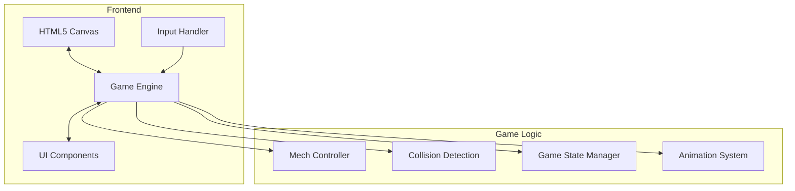

## 1. Architecture Design


## 2. Technology Description
- Frontend: Vanilla JavaScript + HTML5 Canvas + CSS3
- No Backend Required: 纯前端游戏，无需后端
- Rendering: Canvas 2D API
- Animation: requestAnimationFrame

## 3. File Structure
```
/workspace/
├── index.html          # 主页面
├── game.css            # 游戏样式
├── game.js             # 游戏主逻辑
└── assets/             # 像素素材（使用Canvas绘制）
```

## 4. Core Modules

### 4.1 Game Engine
负责游戏主循环、渲染和状态管理
- 初始化画布和游戏环境
- 主循环（update + render）
- 游戏状态控制（开始、进行中、结束）

### 4.2 Mech Controller
机甲角色控制器
- 玩家输入处理
- 移动逻辑（左右移动、跳跃）
- 攻击和防御逻辑
- 状态管理（待机、移动、攻击、防御、受伤）

### 4.3 Collision Detection
碰撞检测系统
- 角色碰撞检测
- 攻击范围检测
- 边界检测

### 4.4 Animation System
像素动画系统
- 帧动画管理
- 角色精灵渲染
- 特效动画

## 5. Key Data Structures

### 5.1 Mech Object
```javascript
{
  x: number,           // 位置X
  y: number,           // 位置Y
  width: number,       // 宽度
  height: number,      // 高度
  vx: number,          // 速度X
  vy: number,          // 速度Y
  hp: number,          // 生命值
  maxHp: number,       // 最大生命值
  state: string,       // 状态（idle/walk/attack/defend/hurt）
  facing: number,      // 朝向（1=右，-1=左）
  attackCooldown: number, // 攻击冷却
  isDefending: boolean,   // 是否防御中
  color: string,       // 机甲颜色
  // ... 动画帧数据
}
```

### 5.2 Game State
```javascript
{
  isRunning: boolean,
  winner: string|null,
  mechs: [Mech, Mech],
  keys: Object,
  // ...
}
```

## 6. Control Scheme

| Action | Player 1 | Player 2 |
|--------|----------|----------|
| Left   | A        | ←        |
| Right  | D        | →        |
| Jump   | W        | ↑        |
| Attack | J        | ,        |
| Defend | K        | .        |

## 7. Pixel Art Rendering
使用Canvas绘制像素风格图形，无需外部图片资源：
- 像素线条使用rect绘制，1px宽度
- 机甲由多个矩形块组成
- 颜色使用主题配色方案
- 扫描线效果使用半透明线条叠加
