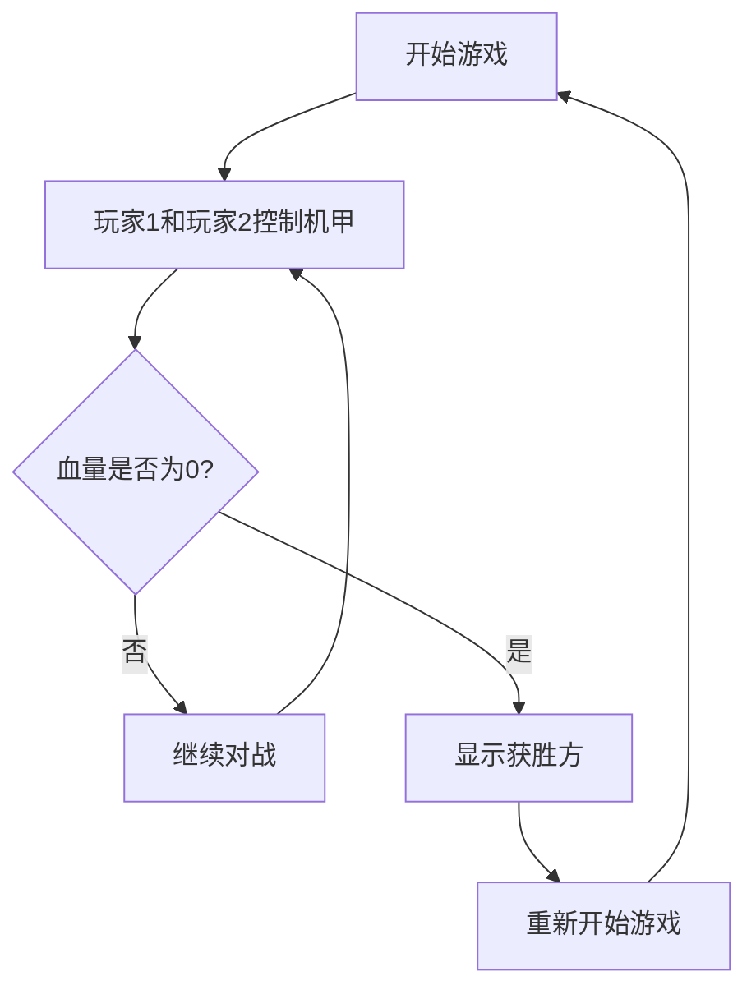

## 1. Product Overview
像素风机甲对战小游戏是一个复古风格的双人对战游戏，两个机甲角色在战场上进行激烈对决。
- 游戏目的：提供简单有趣的像素风对战体验，支持本地双人操作
- 目标用户：喜欢复古游戏和对战类游戏的玩家

## 2. Core Features

### 2.1 User Roles
| Role | Registration Method | Core Permissions |
|------|---------------------|------------------|
| Player 1 | Local keyboard (WASD) | 控制左侧机甲，进行移动、攻击、防御 |
| Player 2 | Local keyboard (方向键) | 控制右侧机甲，进行移动、攻击、防御 |

### 2.2 Feature Module
1. **游戏主页面**：游戏场景展示、两个机甲角色、UI界面（血量条、操作说明）
2. **游戏结束页面**：显示胜负结果、重新开始按钮

### 2.3 Page Details
| Page Name | Module Name | Feature description |
|-----------|-------------|---------------------|
| 游戏主页面 | 游戏场景 | 像素风格背景、地面、战场边界 |
| 游戏主页面 | 机甲角色 | 两个可操作的机甲角色，包含移动、攻击、防御动画 |
| 游戏主页面 | UI界面 | 显示双方血量条、操作说明按键提示 |
| 游戏主页面 | 游戏逻辑 | 碰撞检测、伤害计算、胜负判定 |
| 游戏结束页面 | 结果展示 | 显示获胜方、重新开始按钮 |

## 3. Core Process
玩家通过键盘控制各自的机甲角色，进行移动、攻击和防御。当一方血量降至0时，游戏结束，显示获胜方。

## 4. User Interface Design
### 4.1 Design Style
- **主色调**：深蓝色 (#1a1a2e)、亮青色 (#00ffaa)、橙色 (#ff6b35)
- **辅助色**：深紫色 (#16213e)、亮黄色 (#ffd700)
- **按钮风格**：像素风边框，3D效果，点击反馈
- **字体**：Press Start 2P（像素风格字体），8-16px
- **布局**：居中游戏画布，顶部和底部UI面板
- **视觉风格**：复古像素风，低饱和度色彩，模拟CRT效果

### 4.2 Page Design Overview
| Page Name | Module Name | UI Elements |
|-----------|-------------|-------------|
| 游戏主页面 | 游戏画布 | 800x600像素，深蓝色背景，网格地面 |
| 游戏主页面 | 机甲角色 | 红色机甲（左侧）、蓝色机甲（右侧），32x48像素 |
| 游戏主页面 | 血量条 | 顶部左右各一个，带像素边框和填充动画 |
| 游戏主页面 | 操作说明 | 底部提示，显示WASD和方向键控制 |
| 游戏结束页面 | 结果弹窗 | 居中显示，大字体获胜信息，重新开始按钮 |

### 4.3 Responsiveness
- 桌面端优先，支持响应式缩放
- 游戏画布固定比例，保持像素清晰度

### 4.4 像素效果
- 使用CSS image-rendering保持像素清晰度
- 添加扫描线效果模拟CRT显示器
- 角色动画使用像素级帧动画
