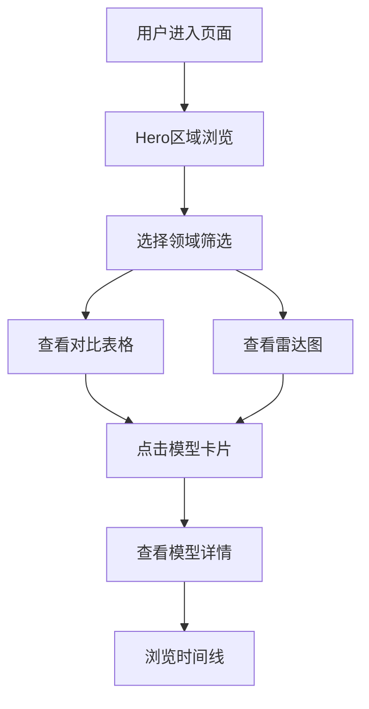

## 1. 产品概述

一个展示2025-2026年最新发布AI模型在不同领域（文本、代码、图像、视频、多模态）性能对比的单页信息网站。解决用户快速了解前沿AI模型能力差异的需求，面向AI从业者、研究人员和技术爱好者。

## 2. 核心功能

### 2.2 功能模块
1. **Hero区域**: 动态标题、粒子背景、模型数量统计
2. **模型对比表格**: 可切换维度的交互式对比表
3. **领域能力雷达图**: 可视化展示各模型在不同领域的能力分布
4. **模型详情卡片**: 悬停展开的详细信息
5. **时间线**: 模型发布时间轴

### 2.3 页面详情
| 页面名称 | 模块名称 | 功能描述 |
|---------|---------|---------|
| 首页 | Hero区域 | 全屏粒子背景，动态标题文字，最新模型数量统计 |
| 首页 | 对比表格 | 支持按领域筛选、排序的交互式表格，展示模型参数、上下文长度、评分等 |
| 首页 | 雷达图 | 展示各模型在6个维度的能力对比（推理、代码、创意、数学、多语言、多模态） |
| 首页 | 模型卡片 | 网格布局的模型卡片，悬停显示详细规格和亮点 |
| 首页 | 时间线 | 横向时间轴展示2025-2026年模型发布历史 |

## 3. 核心流程

用户进入页面 → 浏览Hero区域了解概览 → 通过筛选器选择关注领域 → 查看对比表格/雷达图 → 点击模型卡片查看详情 → 浏览时间线了解发布历史

## 4. 用户界面设计

### 4.1 设计风格
- **主色调**: 深色背景 (#0a0a0f) + 霓虹青蓝 (#00f0ff) 和 电光紫 (#b829dd) 双色调
- **按钮风格**: 极简线条边框，hover时霓虹发光效果
- **字体**: 标题使用 "Orbitron"（科技感），正文使用 "Noto Sans SC"
- **布局风格**: 全宽区块，大量留白，卡片式信息组织
- **图标风格**: Lucide图标，线条风格

### 4.2 页面设计概述
| 页面名称 | 模块名称 | UI元素 |
|---------|---------|--------|
| 首页 | Hero区域 | 全屏Canvas粒子网络背景，居中大标题"2025-2026 AI模型全景"，底部统计数字动画 |
| 首页 | 对比表格 | 深色表头，斑马纹行，hover行高亮，可点击排序表头 |
| 首页 | 雷达图 | Canvas绘制的雷达图，支持模型选择切换，图例可点击隐藏/显示 |
| 首页 | 模型卡片 | 3列网格，卡片带顶部色条区分厂商，hover时上浮并展开详情 |
| 首页 | 时间线 | 横向滚动时间轴，节点为圆形，hover显示发布详情浮层 |

### 4.3 响应式设计
- 桌面端优先（1200px+）
- 平板端（768px-1199px）：表格横向滚动，卡片2列，雷达图缩小
- 移动端（<768px）：卡片单列，时间线纵向排列，表格卡片化展示

### 4.4 动画设计
- Hero标题：字符逐个淡入（stagger 50ms）
- 统计数字：从0滚动到目标值的计数动画
- 卡片：hover时 translateY(-8px) + box-shadow发光
- 表格行：hover时背景色渐变过渡
- 页面滚动：各区块fade-in-up进入视口
- 粒子背景：Canvas绘制的连接点网络，鼠标交互产生涟漪
