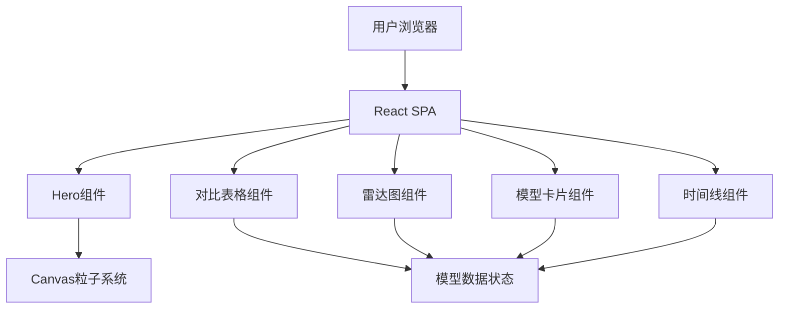

## 1. 架构设计



## 2. 技术描述

- **前端**: React@18 + TypeScript + Tailwind CSS + Vite
- **初始化工具**: vite-init (react-ts模板)
- **状态管理**: Zustand（模型筛选、排序状态）
- **图标**: lucide-react
- **字体**: Google Fonts (Orbitron + Noto Sans SC)
- **动画**: CSS transitions + requestAnimationFrame (Canvas粒子)

## 3. 路由定义

| 路由 | 用途 |
|------|------|
| / | 单页应用首页，包含所有模块 |

## 4. 数据模型

### 4.1 模型数据结构

```typescript
interface AIModel {
  id: string;
  name: string;
  company: string;
  releaseDate: string;
  parameters: string;
  contextLength: string;
  domains: Domain[];
  scores: {
    reasoning: number;
    coding: number;
    creativity: number;
    math: number;
    multilingual: number;
    multimodal: number;
  };
  highlights: string[];
  color: string;
}

type Domain = 'text' | 'code' | 'image' | 'video' | 'multimodal' | 'audio';
```

### 4.2 数据存储

模型数据以内联常量形式存储于 `src/data/models.ts`，包含15-20个2025-2026年发布的真实AI模型数据。

## 5. 组件架构

| 组件 | 职责 |
|------|------|
| ParticleBackground | Canvas粒子网络背景动画 |
| HeroSection | 标题动画、统计数字 |
| ComparisonTable | 可排序筛选的对比表格 |
| RadarChart | Canvas雷达图可视化 |
| ModelCard | 模型信息卡片 |
| Timeline | 横向发布历史时间轴 |
| FilterBar | 领域筛选按钮组 |
| AnimatedCounter | 数字滚动动画 |
| ScrollReveal | 滚动进入视口动画包装器 |
