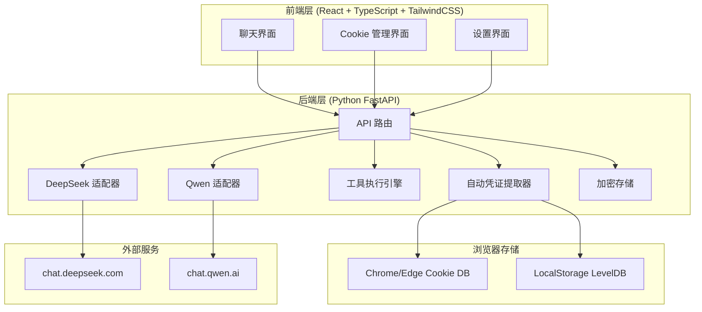
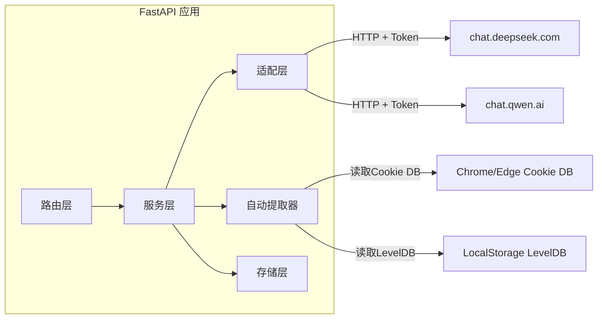
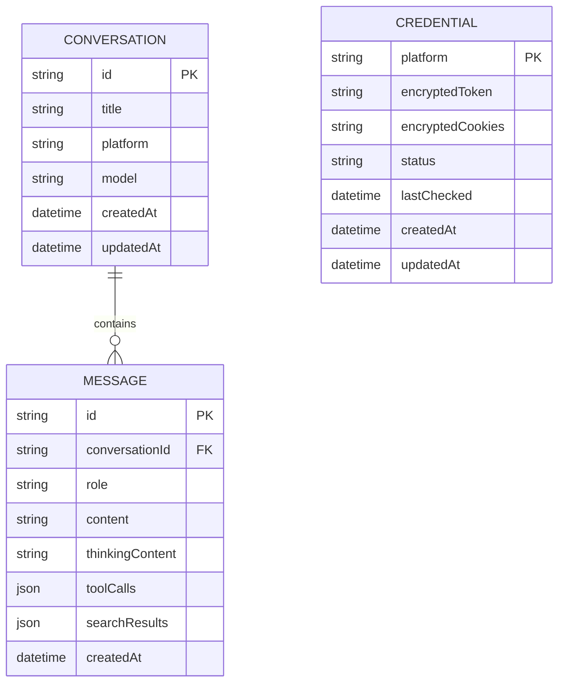

## 1. 架构设计



## 2. 技术说明

- **前端**：React@18 + TypeScript + TailwindCSS@3 + Vite
- **状态管理**：Zustand
- **后端**：Python FastAPI + httpx（异步 HTTP 客户端）
- **Cookie 自动提取**：rookiepy（读取浏览器 Cookie）+ 自定义 LevelDB 读取器（读取 localStorage）
- **加密**：cryptography 库（AES-256-GCM）
- **桌面端**：Tauri 2（Rust 后端 + WebView 前端）
- **图标**：lucide-react
- **Markdown 渲染**：react-markdown + remark-gfm + rehype-highlight
- **流式处理**：SSE (Server-Sent Events)

## 3. 路由定义

| 路由 | 用途 |
|------|------|
| `/` | 聊天主页面 |
| `/cookies` | Cookie 管理页面 |
| `/settings` | 设置页面 |

## 4. API 定义

### 4.1 Cookie 管理

```typescript
interface CredentialInfo {
  platform: "deepseek" | "qwen";
  hasToken: boolean;
  hasCookies: boolean;
  status: "valid" | "expired" | "unknown" | "empty";
  lastChecked: string;
}

// POST /api/cookies/auto-detect
interface AutoDetectRequest {
  platform: "deepseek" | "qwen";
}

interface AutoDetectResponse {
  found: boolean;
  token?: string;
  cookies?: Record<string, string>;
}

// POST /api/cookies/start-login
interface StartLoginRequest {
  platform: "deepseek" | "qwen";
}

interface StartLoginResponse {
  taskId: string;
  status: "polling";
}

// GET /api/cookies/poll/{taskId}
interface PollResponse {
  status: "polling" | "found" | "timeout" | "error";
  token?: string;
  cookies?: Record<string, string>;
}

// POST /api/cookies/manual
interface ManualImportRequest {
  platform: "deepseek" | "qwen";
  token: string;
}

// GET /api/cookies
interface GetCredentialsResponse {
  credentials: CredentialInfo[];
}

// POST /api/cookies/validate
interface ValidateRequest {
  platform: "deepseek" | "qwen";
}

// DELETE /api/cookies/{platform}
```

### 4.2 聊天

```typescript
interface ChatRequest {
  platform: "deepseek" | "qwen";
  model: string;
  messages: Message[];
  stream?: boolean;
  enableSearch?: boolean;
  enableThinking?: boolean;
  expertMode?: boolean;
}

interface Message {
  role: "system" | "user" | "assistant" | "tool";
  content: string;
  toolCallId?: string;
}

// POST /api/chat - 返回 SSE 流
// Content-Type: text/event-stream

interface ChatStreamEvent {
  type: "content" | "thinking" | "tool_call" | "tool_result" | "search" | "error" | "done";
  data: any;
}
```

### 4.3 模型列表

```typescript
// GET /api/models
interface ModelsResponse {
  models: ModelInfo[];
}

interface ModelInfo {
  id: string;
  name: string;
  platform: "deepseek" | "qwen";
  supportsThinking: boolean;
  supportsSearch: boolean;
  supportsTools: boolean;
}
```

## 5. 服务端架构图



## 6. 数据模型

### 6.1 数据模型定义



### 6.2 本地存储设计

- 对话数据：JSON 文件存储在 `~/.zero-token-chat/conversations/`
- 凭证数据：AES-256-GCM 加密存储在 `~/.zero-token-chat/credentials.enc`
- 配置数据：JSON 文件存储在 `~/.zero-token-chat/config.json`

## 7. 自动凭证提取器设计

### 7.1 Cookie 自动读取（rookiepy）

```python
# 使用 rookiepy 从浏览器读取 Cookie
import rookiepy

# 读取 Chrome 的 Cookie
cookies = rookiepy.chrome(domains=["chat.deepseek.com"])
# 返回格式: {"cookie_name": "cookie_value", ...}
```

### 7.2 localStorage Token 自动读取

**Chrome localStorage 存储位置（Windows）**：
- `%LOCALAPPDATA%\Google\Chrome\User Data\Default\Local Storage\leveldb\`

**提取流程**：
1. 定位 Chrome 用户配置目录
2. 读取 LevelDB 文件
3. 查找目标域名对应的 localStorage 条目
4. 提取 `userToken`（DeepSeek）或 `token`（Qwen）

### 7.3 轮询机制

```python
async def poll_for_credentials(platform: str, task_id: str):
    """后台轮询检测浏览器凭证"""
    max_attempts = 150  # 5分钟 / 2秒
    for i in range(max_attempts):
        # 1. 尝试从浏览器读取 Cookie
        cookies = read_browser_cookies(platform)
        # 2. 尝试从浏览器读取 localStorage Token
        token = read_local_storage_token(platform)
        # 3. 如果找到有效凭证，保存并通知
        if token or cookies:
            save_credentials(platform, token, cookies)
            notify_frontend(task_id, "found", token, cookies)
            return
        await asyncio.sleep(2)
    notify_frontend(task_id, "timeout")
```

## 8. DeepSeek 适配器设计

### 8.1 API 端点

- 基础 URL：`https://chat.deepseek.com`
- 聊天端点：`/api/v0/chat/completion`（POST，SSE 流式）
- 创建会话：`/api/v0/chat/create`（POST）
- PoW 挑战：`/api/v0/chat/create_pow_challenge`（POST）

### 8.2 认证方式

- 请求头：`Authorization: Bearer {userToken}`
- Cookie：从浏览器自动提取的完整 Cookie 字符串
- PoW 响应头：`X-Ds-Pow-Response: {pow_response}`

### 8.3 专家模式

- 在请求参数中设置 `model: "deepseek-chat"`
- 启用专家模式相关参数

### 8.4 请求格式

```json
{
  "chat_session_id": "session-uuid",
  "parent_message_id": "message-uuid",
  "prompt": "用户消息",
  "ref_file_id": "",
  "thinking_enabled": true,
  "search_enabled": false
}
```

### 8.5 响应格式（SSE）

```
data: {"choices": [{"delta": {"content": "Hello"}}], "message_id": "xxx"}
data: {"choices": [{"delta": {"content": " world"}}], "message_id": "xxx"}
data: [DONE]
```

## 9. Qwen 适配器设计

### 9.1 API 端点

- 基础 URL：`https://chat.qwen.ai`
- 聊天端点：`/api/chat/completions`（POST，SSE 流式）

### 9.2 认证方式

- 请求头：`Authorization: Bearer {token}`（token 来自 localStorage）

### 9.3 思考模式

- 请求参数中设置 `enable_thinking: true`
- 可配置 `thinking_budget` 控制思考深度

### 9.4 请求格式

```json
{
  "model": "qwen3-235b-a22b",
  "messages": [{"role": "user", "content": "Hello"}],
  "stream": true,
  "enable_thinking": true,
  "thinking_budget": 2048
}
```

## 10. 工具调用设计

### 10.1 支持的工具

| 工具名 | 功能 | 参数 |
|--------|------|------|
| `exec` | 执行命令行命令 | `command: string` |
| `read_file` | 读取文件内容 | `path: string` |
| `write_file` | 写入文件 | `path: string, content: string` |
| `list_dir` | 列出目录内容 | `path: string` |
| `apply_patch` | 应用代码补丁 | `path: string, patch: string` |

### 10.2 工具调用实现

- 在 system prompt 中注入 XML 格式的工具说明
- 解析模型输出中的 `<tool_call>` 标记识别工具调用
- 在本地沙箱中执行工具
- 将执行结果返回给模型继续生成

## 11. 项目目录结构

```
zero-token-chat/
├── src/                          # React 前端
│   ├── components/
│   │   ├── chat/
│   │   │   ├── ChatArea.tsx
│   │   │   ├── MessageBubble.tsx
│   │   │   ├── ThinkingPanel.tsx
│   │   │   ├── ToolCallPanel.tsx
│   │   │   ├── SearchPanel.tsx
│   │   │   └── InputArea.tsx
│   │   ├── sidebar/
│   │   │   ├── Sidebar.tsx
│   │   │   ├── ConversationList.tsx
│   │   │   └── ModelSelector.tsx
│   │   ├── cookies/
│   │   │   ├── CookieManager.tsx
│   │   │   ├── CredentialCard.tsx
│   │   │   └── ImportGuide.tsx
│   │   └── settings/
│   │       └── Settings.tsx
│   ├── hooks/
│   │   ├── useChat.ts
│   │   ├── useCookies.ts
│   │   └── useStream.ts
│   ├── pages/
│   │   ├── ChatPage.tsx
│   │   ├── CookiePage.tsx
│   │   └── SettingsPage.tsx
│   ├── store/
│   │   ├── chatStore.ts
│   │   ├── cookieStore.ts
│   │   └── settingsStore.ts
│   ├── utils/
│   │   ├── api.ts
│   │   └── markdown.ts
│   ├── App.tsx
│   ├── main.tsx
│   └── index.css
├── server/                       # Python FastAPI 后端
│   ├── app/
│   │   ├── __init__.py
│   │   ├── main.py
│   │   ├── routers/
│   │   │   ├── __init__.py
│   │   │   ├── chat.py
│   │   │   ├── cookies.py
│   │   │   ├── models.py
│   │   │   └── tools.py
│   │   ├── services/
│   │   │   ├── __init__.py
│   │   │   ├── deepseek_service.py
│   │   │   ├── qwen_service.py
│   │   │   ├── tool_executor.py
│   │   │   ├── credential_store.py
│   │   │   └── auto_extractor.py
│   │   └── config.py
│   ├── requirements.txt
│   └── start.py
├── package.json
├── vite.config.ts
├── tailwind.config.js
├── tsconfig.json
└── .trae/
    └── documents/
        ├── prd.md
        └── tech-arch.md
```
