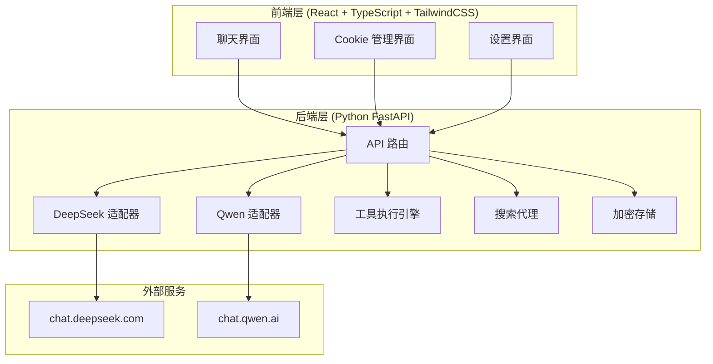
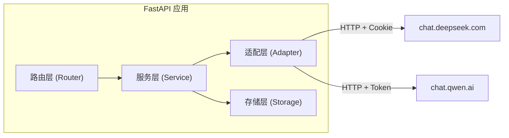
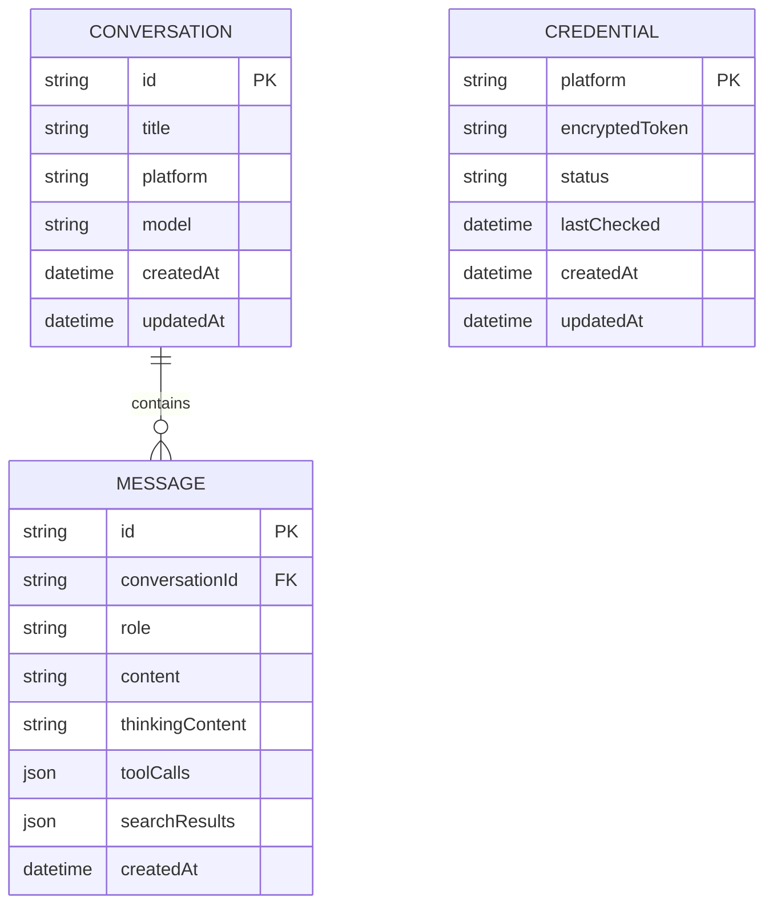

## 1. 架构设计



## 2. 技术说明

- **前端**：React@18 + TypeScript + TailwindCSS@3 + Vite
- **状态管理**：Zustand
- **后端**：Python FastAPI + httpx（异步 HTTP 客户端）
- **加密**：cryptography 库（AES-256-GCM）
- **桌面端**：Tauri 2（Rust 后端 + WebView 前端）
- **图标**：lucide-react
- **Markdown 渲染**：react-markdown + remark-gfm + rehype-highlight
- **流式处理**：SSE (Server-Sent Events)

## 3. 路由定义

| 路由 | 用途 |
|------|------|
| `/` | 聊天主页面 |
| `/cookies` | Cookie 管理页面 |
| `/settings` | 设置页面 |

## 4. API 定义

### 4.1 Cookie 管理

```typescript
interface CookieInfo {
  platform: "deepseek" | "qwen";
  token: string;
  status: "valid" | "expired" | "unknown";
  lastChecked: string;
  expiresAt?: string;
}

// POST /api/cookies
interface SaveCookieRequest {
  platform: "deepseek" | "qwen";
  token: string;
}

// GET /api/cookies
interface GetCookiesResponse {
  cookies: CookieInfo[];
}

// POST /api/cookies/check
interface CheckCookieRequest {
  platform: "deepseek" | "qwen";
}

// DELETE /api/cookies/{platform}
interface DeleteCookieResponse {
  success: boolean;
}
```

### 4.2 聊天

```typescript
interface ChatRequest {
  platform: "deepseek" | "qwen";
  model: string;
  messages: Message[];
  stream?: boolean;
  enableSearch?: boolean;
  enableThinking?: boolean;
  expertMode?: boolean;
}

interface Message {
  role: "system" | "user" | "assistant" | "tool";
  content: string;
  toolCallId?: string;
}

// POST /api/chat - 返回 SSE 流
// Content-Type: text/event-stream

interface ChatStreamEvent {
  type: "content" | "thinking" | "tool_call" | "tool_result" | "search" | "error" | "done";
  data: any;
}
```

### 4.3 模型列表

```typescript
// GET /api/models
interface ModelsResponse {
  models: ModelInfo[];
}

interface ModelInfo {
  id: string;
  name: string;
  platform: "deepseek" | "qwen";
  supportsThinking: boolean;
  supportsSearch: boolean;
  supportsTools: boolean;
}
```

### 4.4 工具执行

```typescript
interface ToolExecuteRequest {
  tool: string;
  args: Record<string, any>;
}

interface ToolExecuteResponse {
  output: string;
  success: boolean;
  error?: string;
}
```

### 4.5 打开浏览器

```typescript
// POST /api/browser/open
interface OpenBrowserRequest {
  platform: "deepseek" | "qwen";
}
```

## 5. 服务端架构图



## 6. 数据模型

### 6.1 数据模型定义



### 6.2 本地存储设计

- 对话数据：JSON 文件存储在 `~/.zero-token-chat/conversations/`
- 凭证数据：AES-256-GCM 加密存储在 `~/.zero-token-chat/credentials.enc`
- 配置数据：JSON 文件存储在 `~/.zero-token-chat/config.json`

## 7. DeepSeek 适配器设计

### 7.1 API 端点

- 基础 URL：`https://chat.deepseek.com`
- 聊天端点：`/api/v0/chat/completion`
- 创建会话：`/api/v0/chat/create`
- PoW 挑战：`/api/v0/chat/create_pow_challenge`

### 7.2 认证方式

- 请求头：`Authorization: Bearer {userToken}`
- Cookie：包含 `intercom-device-id-dgkjq2bp` 等
- PoW 响应头：`X-Ds-Pow-Response: {pow_response}`

### 7.3 专家模式

- 请求参数中设置 `model: "deepseek-chat"` 并启用专家模式标志
- 专家模式支持更长的上下文和更深入的推理

## 8. Qwen 适配器设计

### 8.1 API 端点

- 基础 URL：`https://chat.qwen.ai`
- 聊天端点：`/api/chat/completions`

### 8.2 认证方式

- 请求头：`Authorization: Bearer {token}`（token 来自 localStorage）

### 8.3 思考模式

- 请求参数中设置 `enable_thinking: true`
- 可配置 `thinking_budget` 控制思考深度

## 9. 工具调用设计

### 9.1 支持的工具

| 工具名 | 功能 | 参数 |
|--------|------|------|
| `exec` | 执行命令行命令 | `command: string` |
| `read_file` | 读取文件内容 | `path: string` |
| `write_file` | 写入文件 | `path: string, content: string` |
| `list_dir` | 列出目录内容 | `path: string` |
| `apply_patch` | 应用代码补丁 | `path: string, patch: string` |

### 9.2 工具调用实现

- 在 system prompt 中注入 XML 格式的工具说明
- 解析模型输出中的 `<tool_call>` 标记识别工具调用
- 在本地沙箱中执行工具
- 将执行结果返回给模型继续生成

## 10. 项目目录结构

```
zero-token-chat/
├── src/                          # React 前端
│   ├── components/
│   │   ├── chat/
│   │   │   ├── ChatArea.tsx
│   │   │   ├── MessageBubble.tsx
│   │   │   ├── ThinkingPanel.tsx
│   │   │   ├── ToolCallPanel.tsx
│   │   │   ├── SearchPanel.tsx
│   │   │   └── InputArea.tsx
│   │   ├── sidebar/
│   │   │   ├── Sidebar.tsx
│   │   │   ├── ConversationList.tsx
│   │   │   └── ModelSelector.tsx
│   │   ├── cookies/
│   │   │   ├── CookieManager.tsx
│   │   │   ├── CookieCard.tsx
│   │   │   └── ImportGuide.tsx
│   │   └── settings/
│   │       └── Settings.tsx
│   ├── hooks/
│   │   ├── useChat.ts
│   │   ├── useCookies.ts
│   │   └── useStream.ts
│   ├── pages/
│   │   ├── ChatPage.tsx
│   │   ├── CookiePage.tsx
│   │   └── SettingsPage.tsx
│   ├── store/
│   │   ├── chatStore.ts
│   │   ├── cookieStore.ts
│   │   └── settingsStore.ts
│   ├── utils/
│   │   ├── api.ts
│   │   └── markdown.ts
│   ├── App.tsx
│   ├── main.tsx
│   └── index.css
├── server/                       # Python FastAPI 后端
│   ├── app/
│   │   ├── __init__.py
│   │   ├── main.py
│   │   ├── routers/
│   │   │   ├── __init__.py
│   │   │   ├── chat.py
│   │   │   ├── cookies.py
│   │   │   ├── models.py
│   │   │   └── tools.py
│   │   ├── services/
│   │   │   ├── __init__.py
│   │   │   ├── deepseek.py
│   │   │   ├── qwen.py
│   │   │   ├── tool_executor.py
│   │   │   └── credential_store.py
│   │   ├── adapters/
│   │   │   ├── __init__.py
│   │   │   ├── deepseek_adapter.py
│   │   │   └── qwen_adapter.py
│   │   └── config.py
│   ├── requirements.txt
│   └── start.py
├── src-tauri/                    # Tauri 2 桌面端
│   ├── src/
│   │   └── main.rs
│   ├── Cargo.toml
│   └── tauri.conf.json
├── package.json
├── vite.config.ts
├── tailwind.config.js
├── tsconfig.json
└── .trae/
    └── documents/
        ├── prd.md
        └── tech-arch.md
```
