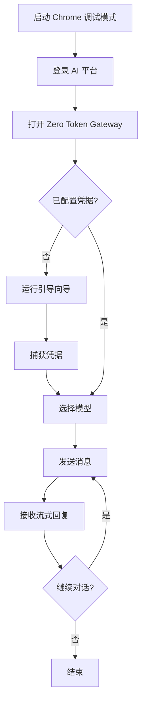

## 1. 产品概述
Zero Token Gateway 是一个独立的 Web 应用，允许用户无需 API Key 即可使用主流 AI 模型。通过捕获浏览器已登录的 AI 平台会话凭据（Cookie + Bearer Token），实现对 DeepSeek、Claude、ChatGPT、Gemini、Qwen、Kimi 等 13+ AI 提供商的免费统一访问。
- 核心价值：消除 API 调用成本，统一多模型入口，提供 OpenAI 兼容网关
- 目标用户：需要横向对比多个 AI 模型的开发者、个人学习用户、成本敏感用户

## 2. 核心功能

### 2.1 用户角色
| 角色 | 注册方式 | 核心权限 |
|------|----------|----------|
| 本地用户 | 无需注册 | 使用所有已配置的 AI 模型 |

### 2.2 功能模块
1. **聊天页面**: 多模型对话、流式响应、模型切换、本地工具调用、官方搜索
2. **AskOnce 页面**: 一问多答，多模型同时对比
3. **配置页面**: 凭据管理、提供商配置、Chrome CDP 连接状态
4. **引导向导**: 首次使用的配置引导

### 2.3 本地工具调用（参考 OpenClaw Zero Token 实现）
通过 Prompt 注入工具定义，使 Web 模型能够调用本地工具。当用户消息中包含工具相关关键词时，自动注入工具提示词。模型回复中包含 JSON 格式的工具调用时，系统解析并执行，然后将结果返回给模型继续生成。

支持的本地工具：
| 工具名称 | 功能描述 | 参数 |
|----------|----------|------|
| web_search | 使用 AI 平台自带的搜索功能 | query: 搜索关键词 |
| web_fetch | 获取指定 URL 的内容 | url: 目标 URL |
| exec | 执行本地命令（受 workspace 限制） | command: 要执行的命令 |
| read | 读取 workspace 中的文件 | path: 文件路径 |
| write | 写入文件到 workspace | path: 文件路径, content: 文件内容 |
| message | 向用户发送消息 | content: 消息内容 |

工具调用流程：
1. 检测用户消息是否包含工具相关关键词
2. 如需要，在 system prompt 中注入工具定义
3. 解析模型回复中的工具调用 JSON
4. 执行工具并将结果作为上下文返回
5. 模型基于工具结果继续生成最终回复

### 2.4 搜索功能
各 AI 平台自带的搜索功能直接使用，无需本地搜索实现：
- DeepSeek: 自动触发联网搜索
- ChatGPT: 自动使用 Browse with Bing
- Claude: 自动使用 web_search 工具
- Qwen: 自动触发联网搜索
- Kimi: 自动触发联网搜索
- Gemini: 自动使用 Google 搜索
- Grok: 自动使用 X 搜索

### 2.5 页面详情
| 页面名称 | 模块名称 | 功能描述 |
|----------|----------|----------|
| 聊天页面 | 模型选择器 | 下拉选择提供商和模型，显示已配置/未配置状态 |
| 聊天页面 | 对话区域 | 流式显示 AI 回复，支持 Markdown 渲染 |
| 聊天页面 | 消息输入 | 发送消息，支持 /model 命令切换模型 |
| AskOnce 页面 | 多模型对比 | 同时向多个模型发送同一问题，并排显示结果 |
| 配置页面 | 提供商列表 | 显示所有支持的 AI 提供商及配置状态 |
| 配置页面 | 凭据捕获 | 一键从 Chrome CDP 捕获登录凭据 |
| 配置页面 | 凭据刷新/删除 | 管理已保存的凭据 |
| 引导向导 | 步骤引导 | 首次使用时引导用户启动 Chrome、登录、捕获凭据 |

## 3. 核心流程

用户首次使用流程：
1. 启动 Chrome 调试模式 → 2. 在浏览器中登录 AI 平台 → 3. 通过引导向导捕获凭据 → 4. 开始聊天

日常使用流程：
1. 打开 Web UI → 2. 选择模型 → 3. 输入消息 → 4. 查看流式回复

## 4. 用户界面设计

### 4.1 设计风格
- 主色调：深色主题（#0a0a0f 背景），霓虹绿（#00ff88）作为强调色
- 按钮风格：圆角、微光效果、hover 时发光
- 字体：JetBrains Mono（代码/技术感）+ DM Sans（正文）
- 布局风格：侧边栏导航 + 主内容区
- 图标风格：线性图标（Lucide）

### 4.2 页面设计概述
| 页面名称 | 模块名称 | UI 元素 |
|----------|----------|---------|
| 聊天页面 | 模型选择器 | 下拉菜单、提供商图标、配置状态指示灯 |
| 聊天页面 | 对话区域 | 气泡式消息、Markdown 渲染、打字机效果 |
| 聊天页面 | 输入区域 | 文本框、发送按钮、模型快捷切换 |
| AskOnce 页面 | 对比面板 | 多列并排卡片、实时流式更新 |
| 配置页面 | 提供商卡片 | 网格布局、状态徽章、操作按钮 |

### 4.3 响应式设计
- 桌面优先设计，移动端自适应
- 侧边栏在移动端可折叠
- AskOnce 对比面板在移动端改为纵向堆叠

### 4.4 动效设计
- 页面加载：渐入动画
- 消息流式输出：打字机效果
- 模型切换：平滑过渡
- 凭据捕获：进度动画
