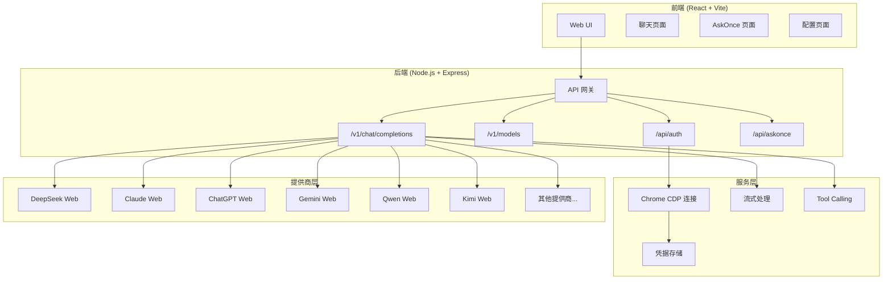
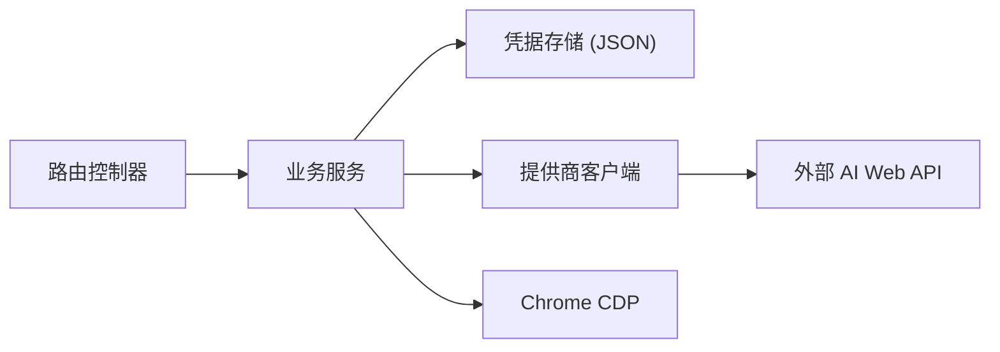

## 1. 架构设计



## 2. 技术说明
- 前端: React@18 + TypeScript + Tailwind CSS@3 + Vite
- 初始化工具: vite-init
- 后端: Express@4 (已实现，纯 JavaScript ESM)
- 数据库: 无（使用 JSON 文件存储凭据）
- 浏览器自动化: Playwright (CDP 连接)

## 3. 路由定义
| 路由 | 用途 |
|------|------|
| / | 聊天主页面 |
| /askonce | AskOnce 多模型对比 |
| /config | 配置和凭据管理 |
| /onboard | 首次使用引导向导 |

## 4. API 定义

### 4.1 聊天补全 API
```typescript
POST /v1/chat/completions
Request: {
  model: string;          // "deepseek-web/deepseek-chat" 或 "qwen-web/qwen-max"
  messages: Array<{role: string; content: string}>;
  stream?: boolean;       // 默认 true
  temperature?: number;
  max_tokens?: number;
}
Response (stream): SSE text/event-stream
Response (non-stream): {
  id: string;
  object: "chat.completion";
  choices: Array<{message: {role: string; content: string}}>;
}
```

### 4.2 模型列表 API
```typescript
GET /v1/models
Response: {
  object: "list";
  data: Array<{id: string; owned_by: string; configured: boolean}>;
}
```

### 4.3 认证 API
```typescript
GET  /api/auth/providers         // 列出所有提供商及配置状态
POST /api/auth/capture           // 从 CDP 捕获凭据
POST /api/auth/refresh           // 刷新凭据
DELETE /api/auth/:providerId     // 删除凭据
GET  /api/auth/chrome-status     // Chrome CDP 连接状态
GET  /api/auth/credentials       // 列出已保存凭据
```

### 4.4 AskOnce API
```typescript
POST /api/askonce
Request: {
  message: string;
  providers?: string[];   // 指定提供商，空则使用所有已配置的
  stream?: boolean;
}
```

## 5. 服务端架构图



## 6. 数据模型

### 6.1 凭据数据
```json
{
  "cookie": "string",
  "bearer": "string",
  "userAgent": "string",
  "updatedAt": 1234567890
}
```

### 6.2 配置数据
```json
{
  "gateway": { "port": 3001, "token": "string" },
  "chrome": { "cdpPort": 9222, "userDataDir": "string" },
  "providers": {}
}
```
